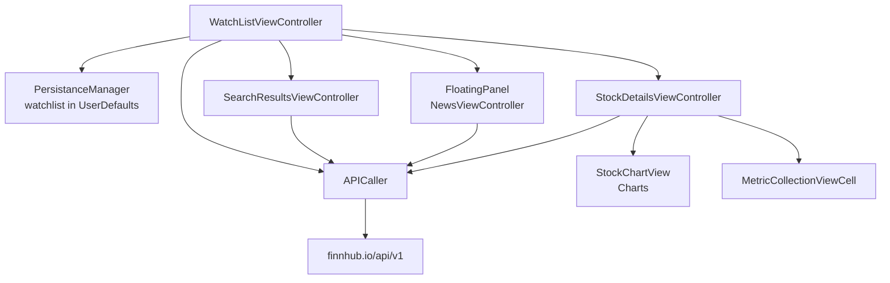
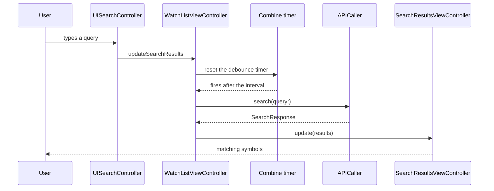

# Stocks and Banking

*A stock watchlist on the Finnhub API, with Combine driven search and a hand drawn price chart.*

      

## Overview

A persistent watchlist on the main screen, a debounced symbol search, a detail screen with price
history and financial metrics, and a news feed that slides up in a floating panel. Written in code
without storyboards.

## Architecture



## Search pipeline



Without the debounce every keystroke would become a request. The timer collapses a burst of typing
into one call, which is the difference between a usable free API tier and an exhausted one.

## Implementation notes

- **Combine as the spine.** The project uses Combine in over sixty places, from the search debounce to
  propagating fetched candles into the chart, rather than passing completion handlers down the stack.
- **Persistence without a database.** `PersistanceManager` stores the watchlist and a first run flag
  in `UserDefaults`, which is the right size of tool for a list of symbols.
- **Chart as a view, not a controller.** `StockChartView` takes a view model of data points and renders
  them, so the same view serves both the watchlist row and the detail header.
- **Layout animated on demand.** `UIViewPropertyAnimator` drives the panel and header transitions,
  which allows them to be reversed mid flight.
- **Formatting once.** Number and date formatters are static, since creating a `DateFormatter` per row
  is a measurable cost in a scrolling table.

## Project structure

```
StocksAndBanking/
├── Managers/       APICaller, PersistanceManager, HapticsManager
├── Models/         SearchResponse, MarketDataResponse, FinancialMetricsResponse, NewsStory
├── Controllers/    WatchList, SearchResults, StockDetails, News
├── Views/          StockChartView, StockDetailHeaderView, cells for watchlist, news and metrics
└── Others/         shared extensions and formatters
```

## Requirements

Xcode 15 or later, iOS 17.2 or later, CocoaPods for FloatingPanel, Charts and SDWebImage. A Finnhub
API key is required.
